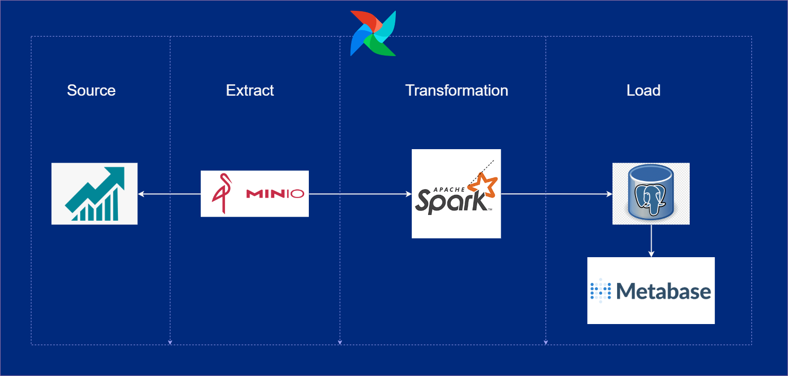
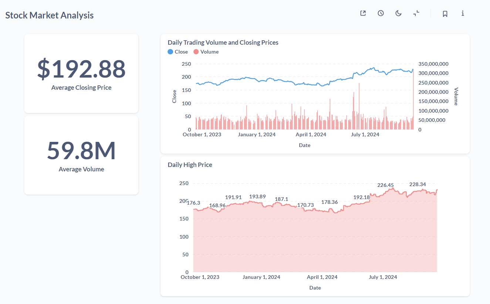

# Stock Market Data Pipeline Using Airflow

## Objective:
This project showcases a robust ETL (Extract, Transform, Load) pipeline built using Apache Airflow to analyze stock market data for Apple Inc. The pipeline automates data collection, transformation, and storage, delivering insightful analytics and visualizations of stock market trends.

## Architecture:

## Dashboard:

## Project Highlights:
- **ETL Pipeline with Airflow:** The heart of the project is an Airflow-managed ETL pipeline that orchestrates the entire data flow—from fetching raw stock data to loading transformed data into a data warehouse.
- **Data Storage with MinIO:** MinIO serves as the object storage solution, holding the raw and processed data securely in a scalable environment.
- **Data Transformation with Spark:** The data is processed and transformed using Apache Spark, allowing for scalable and efficient data manipulation.
- **Data Warehousing in PostgreSQL:**Transformed data is stored in PostgreSQL as the data warehouse, providing a platform for fast querying and analysis.
- **Dashboard with Metabase:** The final output is visualized through a dashboard created in Metabase, allowing for insights into stock market trends and performance.

## Tools and Technologies:
- **Apache Airflow:** Orchestration and automation of the data pipeline.
- **MinIO:** Storage solution for raw and processed data.
- **Apache Spark:** Data transformation and processing.
- **PostgreSQL:** Data warehousing for efficient querying.
- **Metabase:** Dashboard for data visualization and analysis.

## Project Contents:
The project contains the following files and folders:

- dags: This folder contains the Python files for your Airflow DAGs.
- Dockerfile: This file contains a versioned Astro Runtime Docker image that provides a differentiated Airflow experience. If you want to execute other commands or overrides at runtime, specify them here.
- include: This folder contains any additional files that you want to include as part of your project. It is empty by default.
- packages.txt: Install OS-level packages needed for your project by adding them to this file. It is empty by default.
- requirements.txt: Install Python packages needed for your project by adding them to this file. It is empty by default.
- plugins: Add custom or community plugins for your project to this file. It is empty by default.
- airflow_settings.yaml: Use this local-only file to specify Airflow Connections, Variables, and Pools instead of entering them in the Airflow UI as you develop DAGs in this project.

## Deploy Your Project Locally:

1. Start Airflow on your local machine by running 'astro dev start'.

This command will spin up 4 Docker containers on your machine, each for a different Airflow component:

- Postgres: Airflow's Metadata Database
- Webserver: The Airflow component responsible for rendering the Airflow UI
- Scheduler: The Airflow component responsible for monitoring and triggering tasks
- Triggerer: The Airflow component responsible for triggering deferred tasks

2. Verify that all 4 Docker containers were created by running 'docker ps'.
Note: Running 'astro dev start' will start your project with the Airflow Webserver exposed at port 8080 and Postgres exposed at port 5432.

3. Access the Airflow UI for your local Airflow project. To do so, go to http://localhost:8080/ and log in with 'admin' for both your Username and Password.

4. You should also be able to access your Postgres Database at 'localhost:5432/postgres'.

## Slack Notification Setup for Airflow

### Steps to Create Slack Notifications

1. **Visit the Slack API Page**
   - Go to [Slack API](https://api.slack.com/).

2. **Create a New Workspace**
   - Follow the prompts to create a new Slack workspace.

3. **Create an App from Scratch**
   - Click on "Create New App" and select "From Scratch."
   - Give your app a name and select your workspace.

4. **Add Permissions (Scopes)**
   - Under the "OAuth & Permissions" section, scroll down to "Scopes."
   - Add the following scopes:
     - `chat:write`
     - `chat:write.public`

5. **Install the App to Your Workspace**
   - Click on "Install App to Workspace."
   - This will provide you with a **Bot User OAuth Token**.

6. **Add the Token to Airflow Connections**
   - In your Airflow UI, navigate to the "Connections" section.
   - Create a new connection with the following details:
     - **Connection Type:** Slack API
     - **Password:** Paste your Bot User OAuth Token here.

